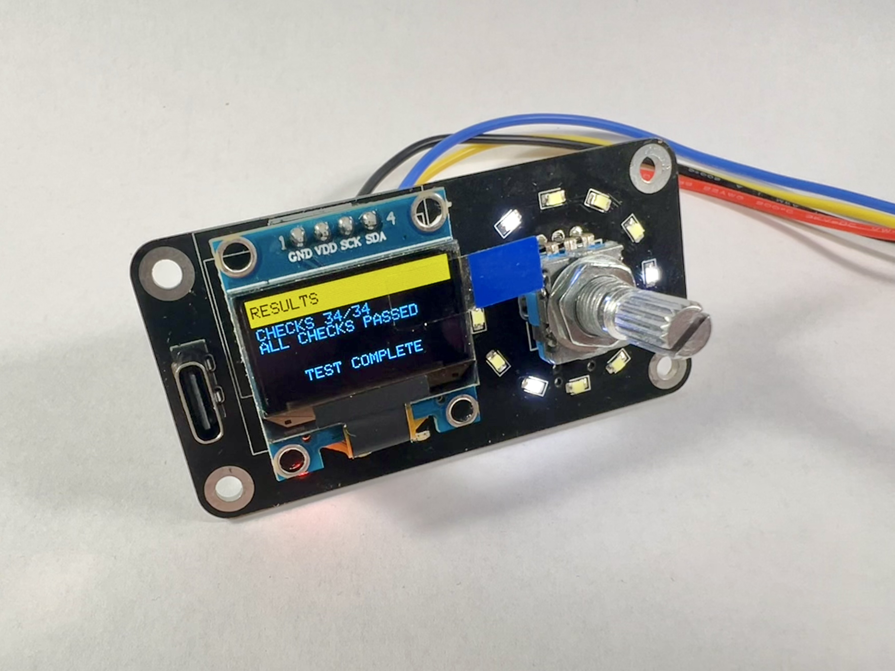
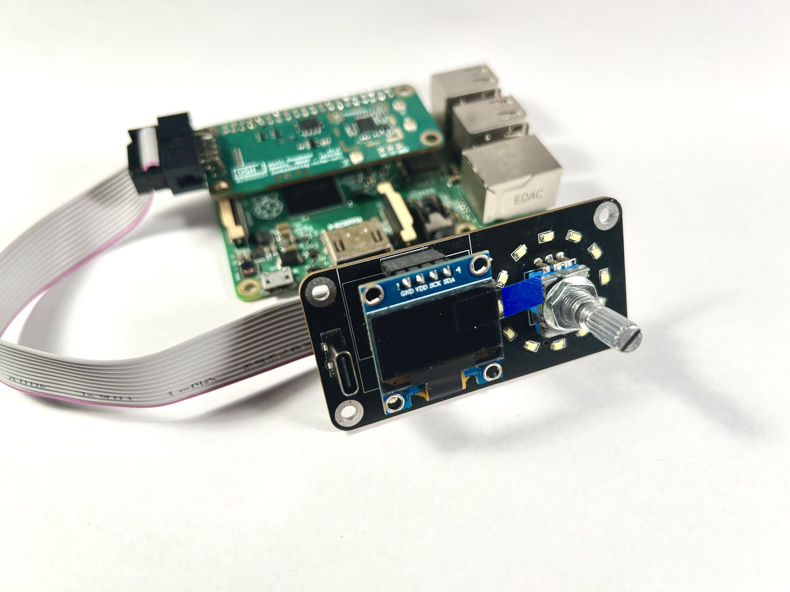
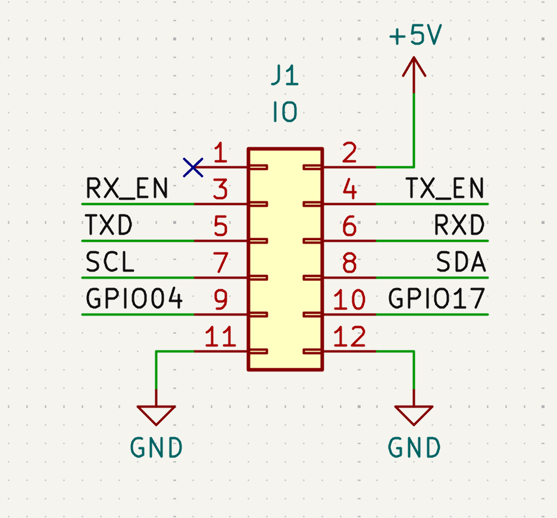

# Rack UI




## Contents

- [**Firmware**](firmware/src/README.md) - firmware for the Rack UI front panel controller board:
  a Puya PY32F002Ax5 (Arm Cortex-M0+) acting as an I2C peripheral, exposing a rotary encoder,
  a push button and a charlieplexed LED array to a host over a single I2C bus. Includes the
  register map, build and flashing instructions, and prebuilt release binaries.

## Flash the firmware

The Rack UI modules you can buy from the [Fred Corp. Store](https://store.fredcorp.cc) come pre-flashed with the latest firmware.

If you made your own Rack Ui board, or if you have an existing Rack Ui board that needs to be updated, you can flash the firmware using the prebuilt release binary from the [firmware release page](https://github.com/yourusername/rack-ui/releases).

### Tools

- SWD programmer (e.g. FlipperZero with DAPLink application, J-Link, etc.) compatible with the [PyOCD](https://pyocd.io/docs/debug_probes.html) toolchain.
- a [TC2030-NL](https://www.tag-connect.com/product/tc2030-idc-nl) programming probe or equivalent to connect the programmer to the Rack UI board's SWD header.

### Software dependencies

- [PyOCD](https://pyocd.io) with the [PY32F002Ax5 CMSIS pack](https://www.keil.arm.com/devices/puya-py32f002ax5/processors/) :

  ```zsh
  pip install pyocd
  pyocd pack install py32f002ax5
  ```

### Load the firmware

Use the following command to flash the firmware onto the Rack UI board. Replace `<version>` with the actual version number of the firmware you want to flash.

```zsh
pyocd load mu-cell_rack-ui_<version>.bin -t py32f002ax5
```

## Pinout



| Pin | Signal |
|---|---|
| 1 | NC |
| 2 | +5V in |
| 3 | RX_EN LED (green) |
| 4 | TX_EN LED (amber) |
| 5 | Target TXD / HT42B534-2 IC RXD |
| 6 | Target RXD / HT42B534-2 IC TXD |
| 7 | SCL |
| 8 | SDA |
| 9 | NC |
| 10 | NC |
| 11 | GND |
| 12 | GND |

---

## License & Acknowledgements

- PY32 Template from [IOsetting](https://github.com/IOsetting/py32f0-template)

Made with ❤️, lots of ☕️, and lack of 🛌  
Published under CreativeCommons BY-SA 4.0

[](http://creativecommons.org/licenses/by-sa/4.0/)  
This work is licensed under a [Creative Commons Attribution-ShareAlike 4.0 International License](http://creativecommons.org/licenses/by-sa/4.0/).
